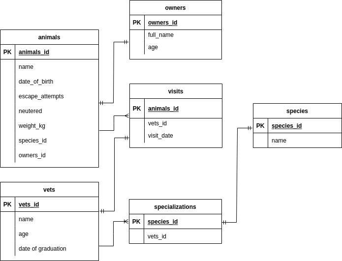

# Vet Clinic Database

Vet Clinic Database is a data structure for a vet clinic and is created using PostgreSQL, a popular relational database. The database contains data about:

- animals
- animals' owners
- clinic employees
- visits

# Schema Diagram
-   

## Getting Started

This repository includes files with plain SQL that can be used to recreate a database:

- Use [schema.sql](./schema.sql) to create all tables.
- Use [data.sql](./data.sql) to populate tables with sample data.
- Check [queries.sql](./queries.sql) for examples of queries that can be run on a newly created database. **Important note: this file might include queries that make changes in the database (e.g., remove records). Use them responsibly!**

## Authors

👤 **Kevin Koome**

- GitHub: [@koomekevo](https://github.com/koomekevo)
- Twitter: [@koomekevo](https://twitter.com/koomekevo)
- LinkedIn: [LinkedIn](https://ke.linkedin.com/in/kevin-koome-aab84186)

## 🤝 Contributing

Contributions, issues, and feature requests are welcome!

Feel free to check the [issues page](../../issues/).

## Show your support

Give a ⭐️ if you like this project!

## 📝 License

This project is [MIT](./MIT.md) licensed.
